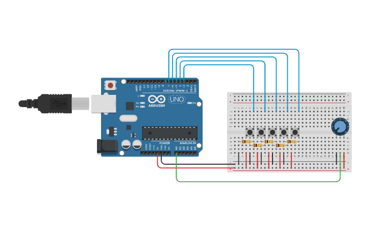

# Stream Deck

An ARDUINO project that turns microswitches into keyboard keys, so that they can be used as a stream deck.

## Circuit Design

This design can be found on [tinkercad.com](https://www.tinkercad.com/things/iYXxymdymQ0-stream-deck).



Component:

1. Breadboard
1. Arduino UNO R3
1. 5x microswitch
1. 5x 10KΩ resisters
1. 1x Potentiometer

All of the components above can be found in this kit:
https://www.amazon.co.uk/gp/product/B01IUY62RM/ref=ppx_yo_dt_b_search_asin_title?ie=UTF8&psc=1

## Install

Installing the pre-requisites

```
cargo install cargo-generate
cargo install ravedude
```

Creating a Rust project

```
cargo generate --git https://github.com/Rahix/avr-hal-template.git
```

## Running

Plug the arduino into your USB port and run it as follows:

Automatically detect the USB port:

```
cargo run
```

or to specify the port you can use:

```
RAVEDUDE_PORT=/dev/<usb_port> cargo run
```

## Software Design

No idea.  Figure it out. :D
